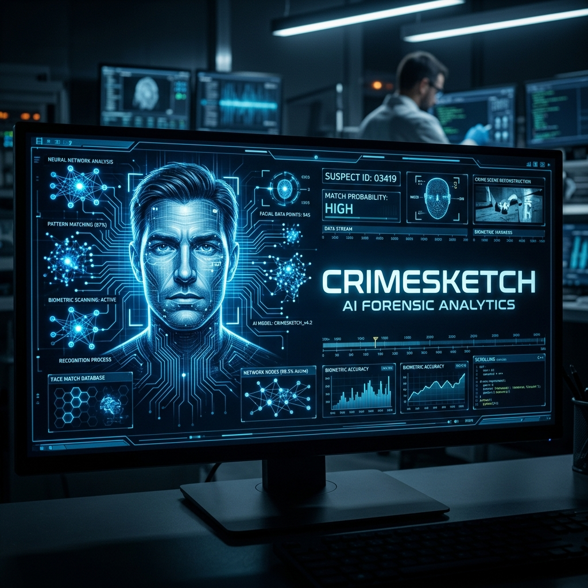

# <p align="center">🕵️‍♂️ CrimeSketch AI</p>

<p align="center">
  
</p>

<p align="center">
  <a href="https://github.com/Priyanshi965/CrimeSketch/blob/main/LICENSE"></a>
  <a href="https://github.com/Priyanshi965/CrimeSketch/issues"></a>
  <a href="https://github.com/Priyanshi965/CrimeSketch/stargazers"></a>
  
</p>

---

## 📖 Overview

**CrimeSketch AI** is a state-of-the-art forensic sketch-to-face recognition system designed for modern law enforcement and investigative agencies. By leveraging deep learning backbones and high-performance similarity search, it bridges the gap between hand-drawn sketches and real-world suspect databases.

It combines a professional **Forensic Console** for active investigations with a **Gamified Training Suite** to sharpen the observational skills of forensic artists.

---

## ⚡ Core Features

### 🔍 AI-Powered Matching
- **Deep Feature Extraction**: Uses a VGGFace2-pretrained `InceptionResnetV1` backbone to map sketches and photos into a shared 512D latent space.
- **Fast Retreival**: Utilizes **FAISS (Facebook AI Similarity Search)** for rank-1 retrieval from millions of records in milliseconds.
- **Real-Time Preprocessing**: Includes CLAHE (Contrast Limited Adaptive Histogram Equalization) and face alignment for consistent matching across varied sketch styles.

### 🎮 Forensic Training Games
- **Stroke Trainer**: Master facial anatomy with segment-by-segment guided drawing.
- **Face Quiz**: Train recall speed by matching target faces from suspect lineups.
- **Speed Sketch**: Test motor memory by sketching suspects under tight time constraints.
- **Match Boost**: Real-time feedback on sketch quality vs. model confidence levels.

### 🖥️ Professional Investigation Suite
- **Metadata Search**: Filter results by city, crime type, and risk level.
- **Evidence Management**: View suspect profiles, previous matches, and forensic notes.
- **Dark-Theme UI**: Optimized for long-duration forensic analysis.

---

## 🏗️ Architecture

| Component | Technology |
| :--- | :--- |
| **Frontend** | React, TypeScript, Vite, Vanilla CSS |
| **App Server** | Node.js, Express, tRPC |
| **ML Backend** | Python, FastAPI, PyTorch |
| **Indexing** | FAISS |
| **Database** | Drizzle ORM, SQLite |

---

## 🚀 Getting Started

### Prerequisites
- [Node.js](https://nodejs.org/) (v18+)
- [Python](https://www.python.org/) (3.9+)
- [pnpm](https://pnpm.io/) (recommended)

### Installation

1. **Clone the Repository**
   ```bash
   git clone https://github.com/Priyanshi965/CrimeSketch.git
   cd CrimeSketch
   ```

2. **Setup Dependencies**
   ```bash
   pnpm install
   # Or npm install
   ```

3. **Initialize ML Backend**
   ```bash
   cd ml_backend
   pip install -r requirements.txt
   python database/seeder.py # Seed forensic metadata
   cd ..
   ```

4. **Run the Application**
   ```bash
   # Windows
   ./start-all.ps1
   
   # Linux/macOS
   ./start-all.sh
   ```

---

## 🤝 Contributing

Contributions are what make the open-source community such an amazing place to learn, inspire, and create. Any contributions you make are **greatly appreciated**.

1. Fork the Project
2. Create your Feature Branch (`git checkout -b feature/AmazingFeature`)
3. Commit your Changes (`git commit -m 'Add some AmazingFeature'`)
4. Push to the Branch (`git push origin feature/AmazingFeature`)
5. Open a Pull Request

---

## 📄 License

Distributed under the MIT License. See `LICENSE` for more information.

<p align="right">(<a href="#top">back to top</a>)</p>
